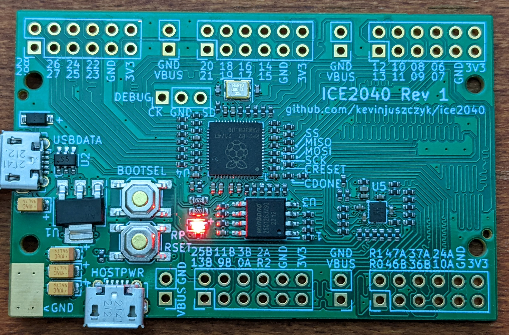

# ICE2040
ICE40UP5K FPGA + RP2040 Hacker Board

## Overview
The ICE2040 combines a Lattice ICE40UP5K FPGA with a Raspberry Pi RP2040. The RP2040 is used to configure the ICE40 SRAM, and optionally provide it a clock or host communication. Pmod connectors are provided for both the ICE40 and RP2040, with the rightmost connectors lined up in such a way that up to 16 additional lines between the ICE40 and RP2040 can be bridged together with a PCB or ribbon cable.
