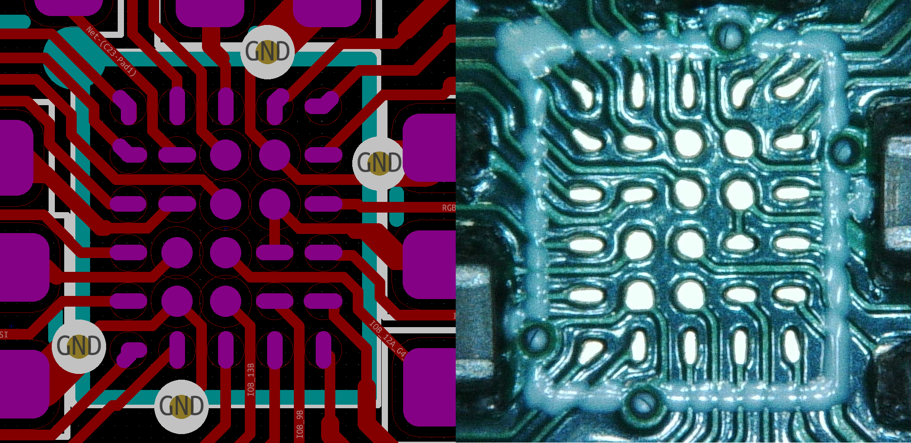

# ICE2040
ICE40UP5K FPGA + RP2040 Hacker Board

## Overview
The ICE2040 combines a Lattice ICE40UP5K FPGA with a Raspberry Pi RP2040. The RP2040 is used to configure the ICE40 SRAM, and optionally provide a clock or host communication. Pmod connectors are provided for both the ICE40 and RP2040, with the rightmost connectors lined up in such a way that up to 16 additional lines between the ICE40 and RP2040 can be bridged together using a PCB or ribbon cable.

## Background
A friend expressed an interest in implementing a RISC-V processor using an FPGA, something like [learn-fpga](https://github.com/BrunoLevy/learn-fpga/blob/master/FemtoRV/TUTORIALS/FROM_BLINKER_TO_RISCV/README.md). Due to the ongoing parts shortage, many of the low-end FPGA dev boards are either out of stock, or have moved out of the pocket change price range. With an eye toward building a board using whatever might still be in stock, I found that the major retailers have many thousands of ICE40 parts in fine pitch BGA packages. I started playing around in KiCad with the ICE40UP5K-UWG30 (30-ball 0.4mm pitch) part to see if there was a way to fan out enough of the pins to make a reasonably useful board. By modifying the shape of the pads, I was able to achieve a complete fanout that can be fabricated with JLCPCB's 4-layer process. Most boards like this use an FTDI serial converter for host communication and FPGA configuration, but these have also been hard to get. I decided to use an RP2040 for these functions, since they are in stock and much less expensive. 

## Build
#### PCB
The board can be fabricated using [JLCPCB's](https://jlcpcb.com/) 4-layer process, and all components assembled (except for the ICE40 and Pmod headers) using their Economic PCBA service. [Jlcfab.zip](./kicad/jlcfab.zip) contains the fabrication files including the BOM, footprint position, drill, and Gerber files. [Jlcboardsettings.txt](./kicad/jlcboardsettings.txt) shows how to configure the JLCPCB order screen. Note that you want to specify the technical review (Confirm Production Files) for both the board fabrication and assembly. This will let JLCPCB adjust the board traces and parts orientation as needed.

NOTE: If you haven't soldered BGA packages before, this is *not* a good one to start with.
1. When the board arrives, check that the RP2040 is functioning correctly by plugging it into the USB port of your PC. A new removable drive should pop up with the volume name of RPI-RP2.
2. Unplug the board.
3. To hand-solder the ICE40, cover the pads of the ICE40 footprint with a thin layer of tacky flux. If too much flux is used, it will boil when heated and dislodge the balls from the package. 
4. Smear a thin layer of solder paste on a flat metal surface, and then press the ICE40 into it. The idea is to get some paste to stick to the balls so that when heat is applied, the paste will flow down and pool on the pads. 
5. Place the ICE40 on the board and line up the package inside the silkscreen while making sure it stays flat on the board. 
6. Reflow either with an oven or by using a hotplate underneath and a heat gun above. 
7. Check that all pins are connected by using the multimeter diode check. Connect the positive lead to board ground, and then touch each ICE40 Pmod pad with the negative lead. A good connection will show a voltage drop between 0.5 to 0.7 volts. Test for continuity between the power rails and ground to make sure they are not shorted. 
8. If you find an open connection, it may be possible to save the part. Dissolve some tacky flux with an equal amount of 99% isopropyl. Drip this mixture around the perimeter of the part so that it wicks underneath. Soak up any excess with a paper towel, and let the flux dry for several hours. Reflow again.

#### Software
1. Hold down the BOOTSEL button on the board while you plug the board into your PC. Once the RPI-RP2 drive pops up, you can release the button.
2. Download the latest release of [CircuitPython](https://circuitpython.org/board/raspberry_pi_pico/)
3. Copy the .UF2 file to the RPI-RP2 drive.
4. The ICE2040 will reboot and a drive labeled CIRCUITPY will pop up.
5. Copy the [top_bitmap.bin](./ice2040/icecube2/multiblink/multiblink_Implmnt/sbt/outputs/bitmap/top_bitmap.bin) file to the CIRCUITPY drive. This is an ICE40 FPGA bitstream designed to blink several LEDs on the bottom center Pmod port (labeled 25B, 13B, etc.)
6. Copy the [code.py](./circuitpython/code.py) file to the CIRCUITPY drive, overwriting the existing file. This is a python script designed to upload the top_bitmap.bin file into the ICE40.
7. If you have an LED Pmod plugged into the bottom center Pmod port, you should now see several LEDs blinking at various rates. A multimeter can also be used to check for correct operation. Pins 13B or 25B change slowly enough to show the voltage alternate between 0 and 3.3 volts.
8. CircuitPython will automatically run the code.py script whenever a file on the CIRCUITPY drive is changed (including top_bitmap.bin). A serial port is also provided for communication with the host PC. See the CircuitPython [documentation](https://learn.adafruit.com/welcome-to-circuitpython) for details.

